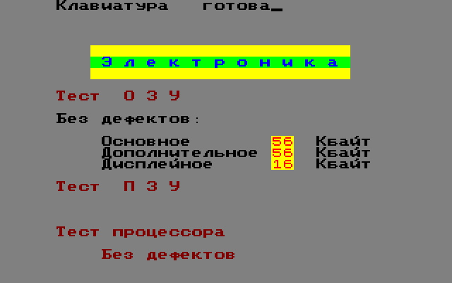
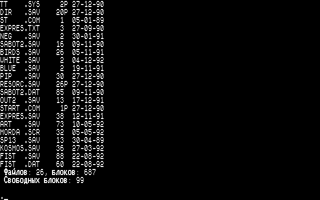
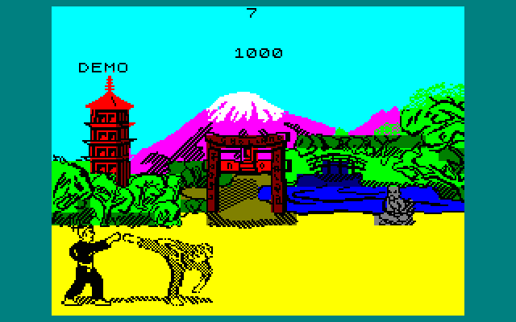
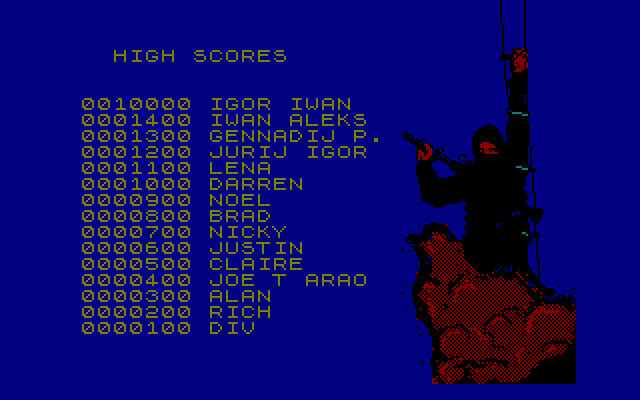
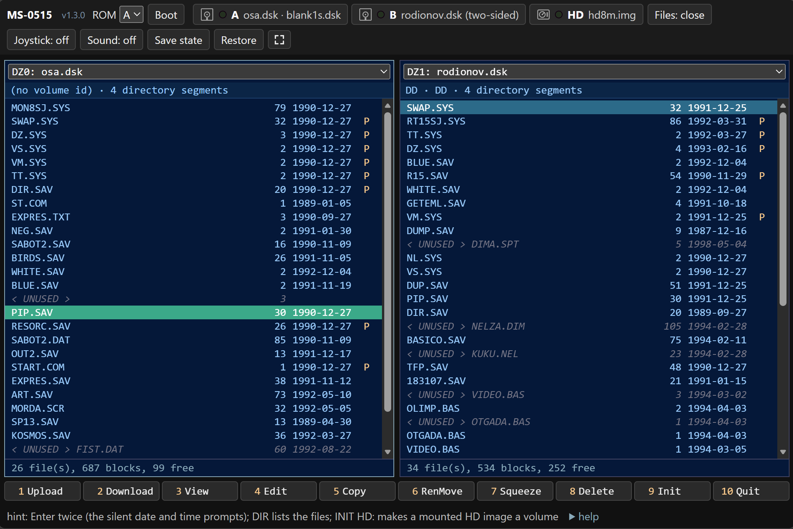

# MS0515 Emulator

An emulator for the **Elektronika MS 0515** — a Soviet PDP-11-compatible
personal computer built around the KR1807VM1 CPU (a clone of the DEC
T-11), produced in the late 1980s.

## Features

| ROM self-test | OSA (RT-11): `DIR` |
|:---:|:---:|
|  |  |
| **The Way of the Exploding Fist**, ported to the MS-0515 | **SABOT2** (1990) |
|  |  |




- KR1807VM1 CPU emulation (PDP-11 instruction set, 66 instructions)
- Full memory subsystem with bank switching and 512 KB RAM-disk expansion
- WD1793 / KR1818VG93 floppy controller (2 physical drives × 2 sides,
  400 KB per side; reads single-side and track-interleaved double-side
  raw images directly)
- Paravirtual hard disk (HD:) — mounts a backing image of any size for
  use with the RT-11 HD.SYS driver (`--hd <path>`; shares bus addresses
  with the unused serial port, so the two are mutually exclusive).
  `assets/disks/vvv.dsk` is a bootable RT-11 with HD.SYS ready to use
- Folder-backed devices — mount a host FOLDER as a floppy or the HD:
  via a plain-text `.rtfs` descriptor: files map to RT-11 files both
  ways (external edits visible inside, guest writes materialize host
  files), bootable system folders included (see `docs/folder-device.md`)
- KR580VI53 (Intel 8253) programmable interval timer
- MS7004 keyboard with an on-screen virtual keyboard (OSK)
- The joystick on the MS7007 port (five lines in the Kempston order, as
  SABOT2 and FIST read it): the arrows and Space or an SDL game controller
  (Components → Joystick); in the browser, the arrows / a touch stick
- Video: 320×200 with 8-colour attribute mode, or 640×200 monochrome
- Audio output (timer-driven beeper)
- Built-in debugger with disassembler and GDB-RSP server
- Save / load state snapshots (Machine menu)
- YAML config file for persistent settings
- Boots RT-11 and its Soviet derivatives (OSA, Omega, Mihinsoft OS-16SJ)
- Runs in the browser too - <https://vvv104.github.io/ms0515/>: the core
  and the lib compiled with Emscripten behind a small C API and a static
  page (`src/web/`); the machine runs in the tab, the drives mount like the
  desktop front-ends' (a floppy per side, a paravirtual HD, your own images),
  disks the guest writes to stay in the browser's storage
- Guest programs built with the real RT-11 toolchain inside the emulator
  (`rt11_devel/`): a faithful MACRO-11 port of *The Way of the Exploding
  Fist* (`rt11_devel/projects/fist/`), playable from `assets/disks/osa.dsk`
  with `R FIST`

## Repository structure

```
docs/           Technical documentation (architecture, hardware, kb, TODO)
src/            Emulator source code and build system
  core/         Hardware emulation in pure C11
    tests/      Unit tests for the C core (cpu, memory, timer, …)
  lib/          C++ wrapper (Emulator, Debugger, Disassembler, GDB stub)
    tests/      Lib-level tests + trimmed-OS disk fixtures (boot smoke,
                screen reader, terminal, emulated keyboard)
  frontend/     SDL2 + Dear ImGui application
    tests/      Placeholder for future frontend tests
  assets/       Runtime resources shipped to end users (ROMs, keyboard
                layout, original-OS disk images)
tools/          Utility scripts (PDP-11 disassembler, disk tools)
```

## Building

### Prerequisites

- C/C++ compiler with C11 and C++23 support
  - Windows: Visual Studio 2022+ Build Tools (MSVC 19.5+)
  - Linux: GCC 13+ or Clang 17+
  - macOS: Xcode 15+ / Apple Clang
- [Conan 2](https://conan.io/) package manager
- CMake 3.16+ and Ninja (Conan installs Ninja automatically if missing)

See `src/README.md` for the full set-up guide and Conan profile tips.

### Build steps

```bash
cd src
conan build . --build=missing
```

The build produces a self-contained `package/` directory (at the repo
root) with the executable and all required assets.

### Running

```bash
cd package
ms0515.exe --disk0-side0 path/to/disk.dsk
```

Command-line options:

| Option | Short | Description |
|--------|-------|-------------|
| `--rom <path>` | | ROM image (default: `assets/rom/ms0515-roma.rom`) |
| `--disk0 <path>` | `-d0` | Drive 0, both sides from a 819200-byte track-interleaved DS image |
| `--disk0-side0 <path>` | `-d0s0` | Drive 0, lower side (409600-byte SS image) |
| `--disk0-side1 <path>` | `-d0s1` | Drive 0, upper side |
| `--disk1 <path>` | `-d1` | Drive 1, both sides from a track-interleaved DS image |
| `--disk1-side0 <path>` | `-d1s0` | Drive 1, lower side |
| `--disk1-side1 <path>` | `-d1s1` | Drive 1, upper side |

`--diskN` and `--diskN-sideM` for the same N are mutually exclusive.
Diagnostic flags for headless / debugging runs (`--frames`, `--history-*`)
are documented in the source comment at the top of
`src/frontend/src/main.cpp` and in `ms0515-cli --help`.

Disks can also be mounted at runtime via the File menu.

## Documentation

- [Architecture overview](docs/architecture.md)

### Hardware

- [Board](docs/hardware/board.md) — system integration, interrupts, I/O mapping
- [CPU](docs/hardware/cpu.md) — KR1807VM1 / DEC T-11 instruction set, addressing modes, traps
- [Memory](docs/hardware/memory.md) — bank switching, I/O page layout
- [Video](docs/hardware/video.md) — framebuffer, palette, scroll registers
- [Keyboard](docs/hardware/keyboard.md) — MS7004 protocol, scancodes, auto-repeat
- [Timer](docs/hardware/timer.md) — KR580VI53 (Intel 8253) programmable interval timer
- [Floppy](docs/hardware/floppy.md) — KR1818VG93 (WD1793) FDC, disk format, layouts
- [Filesystem](docs/hardware/filesystem.md) — RT-11 disk layout, sector interleave
- [RAM disk](docs/hardware/ramdisk.md) — 512 KB expansion board

### Knowledge base

- [Known issues](docs/kb/KNOWN_ISSUES.md) — disk/ROM-specific quirks
  and OS-level peculiarities encountered while reverse-engineering
- [Disk copying](docs/kb/DISK_COPYING.md) — how to clone `.dsk`
  images, including copy-protected ones, on host or inside the emulator
- [TODO](docs/kb/TODO.md) — non-bug deferrals and future-improvement
  notes
- [References](docs/kb/REFERENCES.md) — external resources used
  while implementing the emulator
- [Verification](docs/kb/VERIFICATION.md) — cross-checks against
  real-hardware behaviour

## License

The emulator's sources, tools and documentation are released under the
[MIT License](LICENSE) — use them freely, keep the copyright notice with
its link to this repository.

The files under `src/assets/` (the machine's ROMs, the original operating
system and program disk images) are historical artifacts of the
Elektronika MS 0515 and its software, preserved here for the emulator to
run them; they are not covered by the license above and remain the
property of their respective authors.
